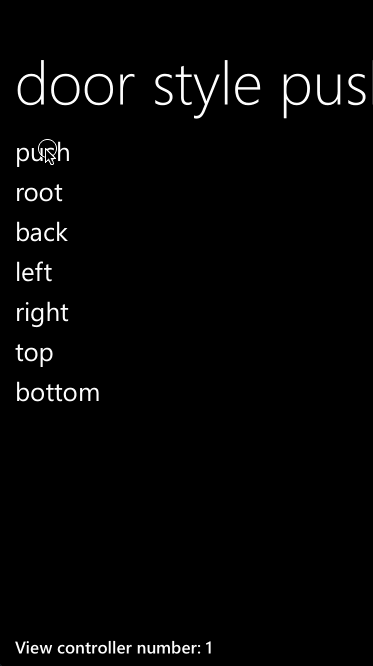

LPDoorStyleNavigationController
====================================

Enables push animation with "door" effect. Available customizations:

* duration of animation (property animationDuration)
* side (left/right/top/bottom, see enum LPDoorSide)

## Using

Copy **LPDoorStyleNavigationController.h** and **LPDoorStyleNavigationController.m** into your project and use it like regular UINavigationController. 